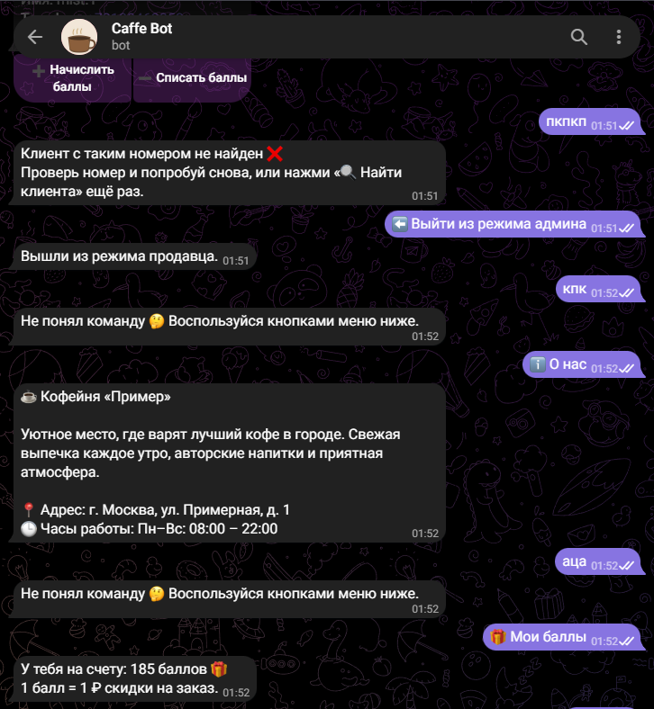
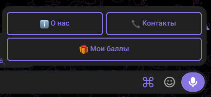
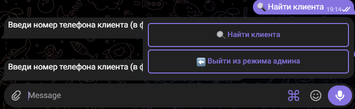

# Тг-бот для кофейни

Telegram-бот системы лояльности для кофейни: клиенты копят и тратят баллы, продавец управляет начислением/списанием через отдельный админ-режим.

Стек: Python 3.10+, aiogram 3.x, SQLite (aiosqlite).

## Скриншоты

**Главное меню клиента**



**Диалог с ботом**



**Админ-режим (поиск клиента, начисление/списание баллов)**



## Функционал (по ТЗ)
- Меню на кнопках
- «О нас»: фото кафе, описание, адрес, часы работы
- «Контакты» отдельной кнопкой
- Регистрация по номеру телефона (привязка к аккаунту)
- Баллы: начисляются % от суммы заказа, тратятся как скидка (1 балл = 1 ₽)
- Режим продавца/админа: поиск клиента по телефону, начисление и списание баллов

## Установка

```bash
pip install -r requirements.txt
```

## Настройка

1. Скопируй `.env.example` в `.env`
2. Открой `.env` и укажи:
   - `BOT_TOKEN` — токен от @BotFather
   - `ADMIN_IDS` — telegram_id продавцов через запятую (узнать свой id можно у @userinfobot)
3. В `config.py` при желании поменяй:
   - `POINTS_PER_RUBLE` — процент кэшбэка (по умолчанию 0.05 = 5%)
   - `CAFE_INFO` — тексты, адрес, часы работы, контакты
4. Положи фото кафе в папку `photos/` и пропиши пути в `CAFE_INFO["photos"]`

## Запуск

```bash
python main.py
```

## Как пользоваться

**Клиент:**
- `/start` → отправляет номер телефона → попадает в главное меню
- «О нас» / «Контакты» / «Мои баллы»

**Продавец/админ** (только если ваш telegram_id в `ADMIN_IDS`):
- `/admin` → включает режим продавца
- «🔍 Найти клиента» → ввести номер телефона
- Бот покажет баланс баллов клиента и кнопки «Начислить» / «Списать»
- При начислении: вводишь сумму заказа → баллы начисляются автоматически по проценту
- При списании: вводишь количество баллов → списываются (списать больше остатка нельзя)

## Деплой на сервер (чтобы бот работал 24/7)

Нужен любой VPS (от ~150–300 ₽/мес). Пример через systemd:

1. Залить проект на сервер, установить зависимости
2. Создать сервис `/etc/systemd/system/coffeebot.service`:
   ```ini
   [Unit]
   Description=Coffee Telegram Bot
   After=network.target

   [Service]
   WorkingDirectory=/path/to/coffee_bot
   ExecStart=/usr/bin/python3 main.py
   Restart=always

   [Install]
   WantedBy=multi-user.target
   ```
3. `systemctl enable coffeebot && systemctl start coffeebot`

## Структура проекта

```
config.py          — настройки, тексты кофейни
database.py        — работа с SQLite (пользователи, транзакции баллов)
keyboards.py        — клавиатуры бота
states.py           — FSM-состояния (регистрация, флоу админа)
handlers_user.py    — хендлеры обычного пользователя
handlers_admin.py   — хендлеры режима продавца/админа
main.py             — точка входа
requirements.txt    — зависимости
photos/             — фото кафе для раздела «О нас»
screenshots/         — скриншоты интерфейса для портфолио
```
